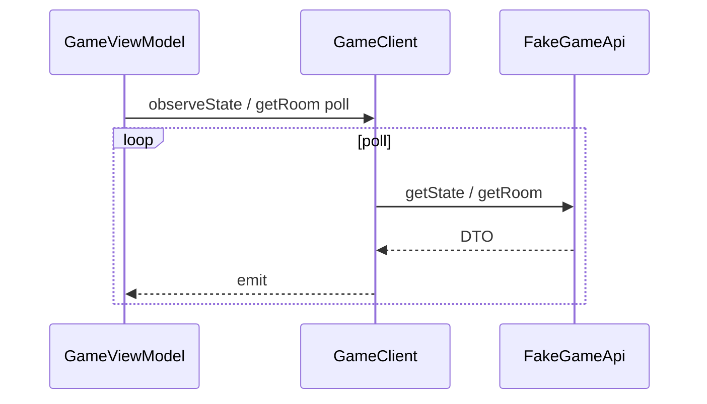
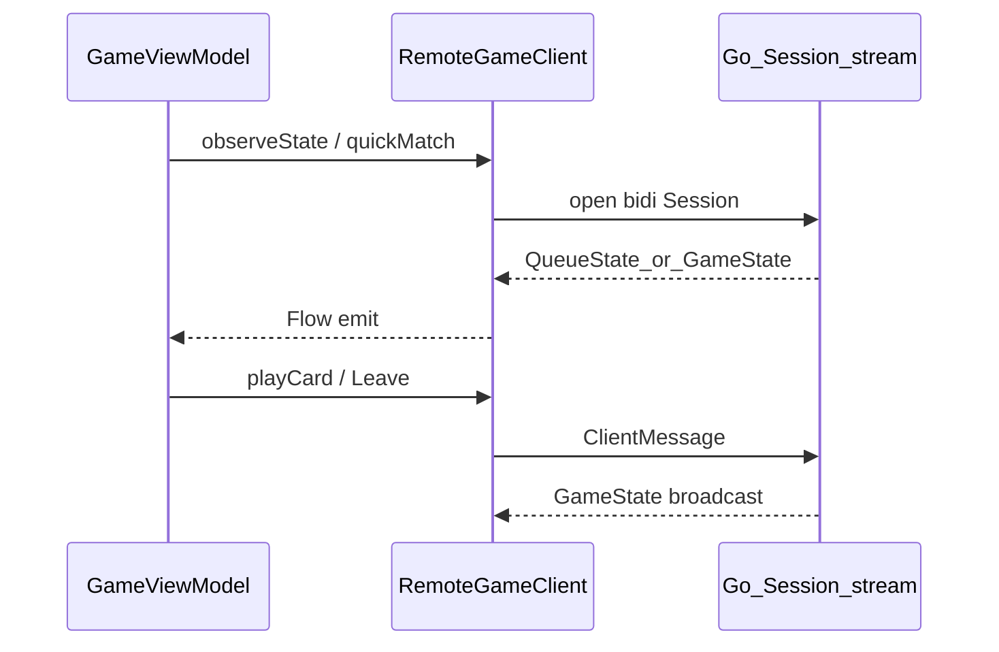
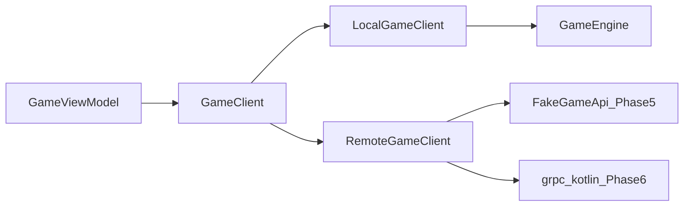

# GameClient

Ключевая абстракция игровой сессии. ViewModel экрана игры **не знает**, локальная это сессия или сетевая.

## Интерфейс

```kotlin
interface GameClient {
    suspend fun login(displayName: String? = null): Result<Unit>
    fun isAuthorized(): Boolean
    /**
     * Быстрая игра.
     * Phase 5 (fake): одна попытка; null = ещё ждать (клиент poll).
     * Phase 6 (gRPC): открывает Session stream + QuickMatch; результат через observe / callback потока очереди.
     */
    suspend fun quickMatch(displayName: String, avatarId: Int): Result<GameSessionId?>
    suspend fun createPrivateGame(displayName: String, avatarId: Int): Result<CreateGameResult>
    suspend fun joinByCode(code: String, displayName: String, avatarId: Int): Result<Pair<GameSessionId, String>>
    suspend fun getRoom(sessionId: GameSessionId): Result<RoomStateDto>
    suspend fun kickPlayer(sessionId: GameSessionId, playerId: String): Result<Unit>
    suspend fun startGame(sessionId: GameSessionId): Result<Unit>
    suspend fun createSession(config: GameConfig): GameSessionId
    suspend fun getState(sessionId: GameSessionId): GameStateDto
    fun observeState(sessionId: GameSessionId, pollIntervalMs: Long = DEFAULT_POLL_INTERVAL_MS): Flow<GameStateDto>
    // playCard, addCard, pass, bito, ready, leaveSession, skipTurn…
}
```

На Phase 6 online: `observeState` / очередь QuickMatch — **подписка на gRPC stream**, не HTTP-poll. Методы `getRoom` могут стать тонкой обёрткой над последним `RoomState` со stream или уйти из online-пути.

## Разделение действий

| Метод | Phase 5 (fake) | Phase 6 (gRPC) |
|-------|----------------|----------------|
| `login` | stub login | unary `Auth.Login` |
| `quickMatch` | poll-имитация | `Session` + `QuickMatch` → `QueueState` / `MatchStarted` |
| `createPrivateGame` | fake create | unary `CreateGame` |
| `joinByCode` | fake join | unary `JoinGame` → затем `Subscribe` |
| `getRoom` / kick / start | fake REST | сообщения stream / кэш RoomState |
| `playCard` / … | stub / local | исходящий stream |
| `leaveSession` | локальная очистка | **`ClientMessage.Leave`** |

Профиль в matchmaking — в теле QuickMatch/create/join.

## Наблюдение состояния

### Offline (`LocalGameClient`)

Tick / poll engine + emit после действий (как Phase 4).

### Online Phase 5 (`RemoteGameClient` + Fake)



### Online Phase 6 (gRPC)



- Комната / матч: **server push**, не poll 2 с / 5 с.
- Keepalive + reconnect при смене сети; после reconnect — полный снимок.

## GameStateDto

Без изменения контракта UI: `sessionId`, `phase`, `players` (handCount), `localHand`, стол, козырь, `can*`, события и т.д.  
На wire Phase 6 — protobuf `GameState`, маппинг в DTO.

## Реализации



| Реализация | Этап | Источник состояния |
|------------|------|-------------------|
| `LocalGameClient` | Phase 4 | `GameEngine` in-process |
| `RemoteGameClient` + Fake | Phase 5 | stubs |
| `RemoteGameClient` + gRPC | Phase 6 | Go server bidi Session |

UI и ViewModel по возможности не меняются при offline → online; Phase 6 убирает poll-циклы лобби/матча в пользу Flow со stream.

Подробности сервера: [`server/docs`](../../server/docs/README.md).
