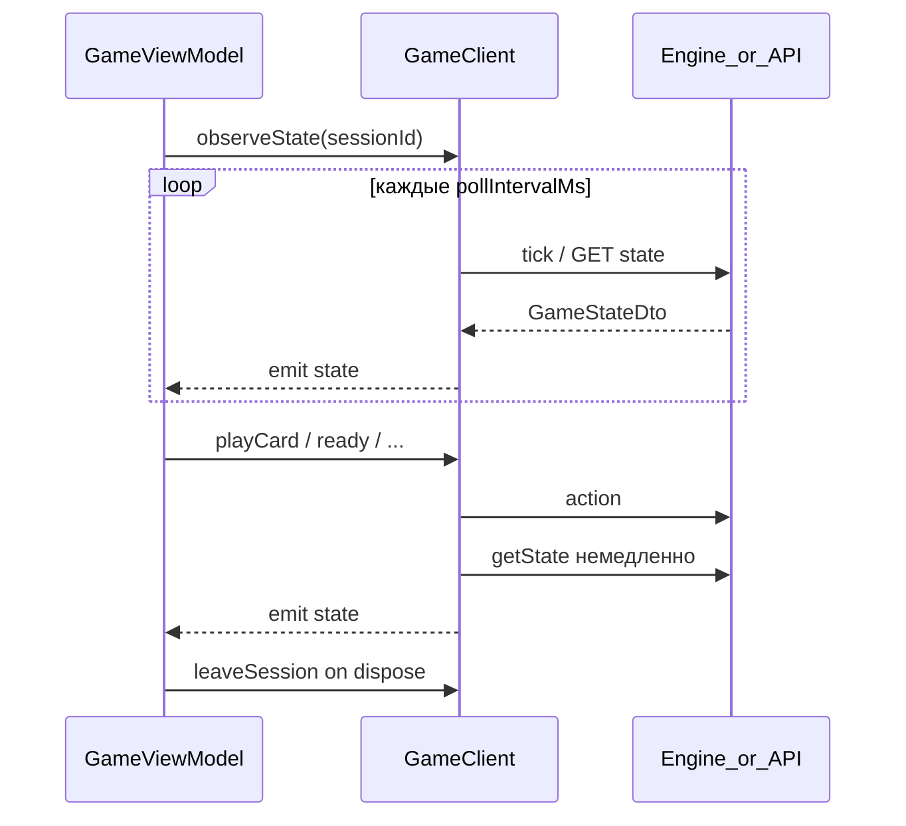
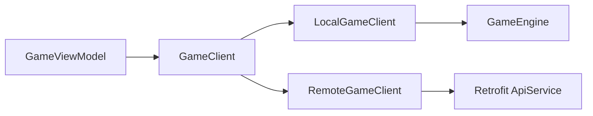

# GameClient

Ключевая абстракция игровой сессии. ViewModel экрана игры **не знает**, локальная это сессия или сетевая.

## Интерфейс

```kotlin
interface GameClient {
    suspend fun createSession(config: GameConfig): GameSessionId
    suspend fun getState(sessionId: GameSessionId): GameStateDto
    fun observeState(
        sessionId: GameSessionId,
        pollIntervalMs: Long = DEFAULT_POLL_INTERVAL_MS, // 2000
    ): Flow<GameStateDto>
    suspend fun playCard(sessionId: GameSessionId, card: Card, targetPairId: Int?): Result
    suspend fun addCard(sessionId: GameSessionId, card: Card): Result
    suspend fun pass(sessionId: GameSessionId): Result
    suspend fun bito(sessionId: GameSessionId): Result
    suspend fun ready(sessionId: GameSessionId): Result
    suspend fun leaveSession(sessionId: GameSessionId)
}
```

## Разделение действий

| Метод | Назначение |
|-------|------------|
| `playCard` | Атака или отбивка (`targetPairId` — id пары на столе) |
| `addCard` | Подкидывание карты того же достоинства |
| `pass` | Отказ от дальнейших действий в раунде |
| `bito` | Завершение успешно отбитого раунда |
| `ready` | Подтверждение готовности (лобби) |
| `leaveSession` | Выход из игры, остановка observeState |

## Tick и периодический опрос



### Поведение

- `GameViewModel` подписывается на `observeState()` в `viewModelScope`; при уходе Flow отменяется.
- После любого action — **немедленный** `getState`, не ждать следующий интервал.
- **LocalGameClient**: tick → `GameEngine.onTick()` (auto-ready ботов, таймауты).
- **RemoteGameClient**: tick → `GET /games/{id}/state`.

## GameStateDto

```kotlin
data class PlayerStateDto(
    val id: String,
    val displayName: String,
    val avatarId: Int,
    val handCount: Int,
    val isReady: Boolean,
    val isConnected: Boolean,
    val status: PlayerStatus, // WAITING, PLAYING, DISCONNECTED, LEFT
)

enum class GamePhase { LOBBY_WAITING, IN_PROGRESS, FINISHED }

data class GameStateDto(
    val sessionId: String,
    val phase: GamePhase,
    val players: List<PlayerStateDto>,
    val serverTick: Long?,
    // стол, колода, козырь, текущий ход
)
```

## Реализации



| Реализация | Этап | Источник состояния |
|------------|------|-------------------|
| `LocalGameClient` | Phase 4 | `GameEngine` in-process |
| `RemoteGameClient` | Phase 5–6 | REST API |

UI и ViewModel **не меняются** при переходе offline → online.
