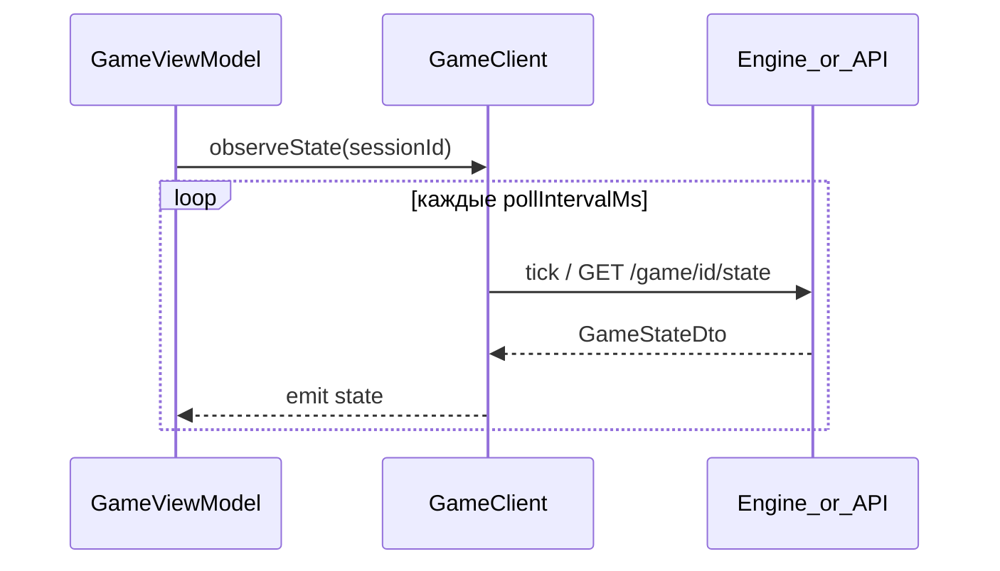
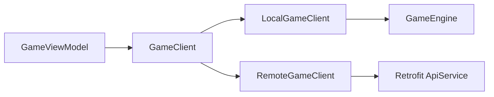

# GameClient

Ключевая абстракция игровой сессии. ViewModel экрана игры **не знает**, локальная это сессия или сетевая.

## Интерфейс

```kotlin
interface GameClient {
    suspend fun login(displayName: String? = null): Result<Unit>
    fun isAuthorized(): Boolean
    /** Быстрая игра: одна попытка; null = ещё ждать. */
    suspend fun quickMatch(displayName: String, avatarId: Int): Result<GameSessionId?>
    suspend fun createPrivateGame(displayName: String, avatarId: Int): Result<CreateGameResult>
    suspend fun joinByCode(code: String, displayName: String, avatarId: Int): Result<GameSessionId>
    suspend fun getRoom(sessionId: GameSessionId): Result<RoomStateDto>
    suspend fun kickPlayer(sessionId: GameSessionId, playerId: String): Result<Unit>
    suspend fun startGame(sessionId: GameSessionId): Result<Unit>
    suspend fun createSession(config: GameConfig): GameSessionId
    suspend fun getState(sessionId: GameSessionId): GameStateDto
    fun observeState(sessionId: GameSessionId, pollIntervalMs: Long = DEFAULT_POLL_INTERVAL_MS): Flow<GameStateDto>
    // playCard, addCard, pass, bito, ready, leaveSession, skipTurn…
}
```

## Разделение действий

| Метод | Назначение |
|-------|------------|
| `login` | Вход (`POST /auth/login`) |
| `quickMatch` | `POST /game/fast/join` (poll с клиента каждые 5 с) |
| `createPrivateGame` | `POST /game/create` |
| `joinByCode` | `POST /game/join` |
| `getRoom` | `GET /game/{id}/room` |
| `kickPlayer` | `POST /game/{id}/kick` |
| `startGame` | `POST /game/{id}/start` |
| `playCard` / … | Игровые действия |
| `leaveSession` | Выход |

Профиль в matchmaking передаётся в теле join/create; отдельных get/update profile для лобби нет.

## Tick и периодический опрос



- Комната ожидания: poll `getRoom` каждые **5 с** (`ROOM_POLL_INTERVAL_MS`).
- **RemoteGameClient**: матч → `GET /game/{id}/state`.

## GameStateDto

```kotlin
data class PlayerStateDto(
    val id: String,
    val displayName: String,
    val avatarId: Int,
    val handCount: Int,
    val isReady: Boolean,
    val isConnected: Boolean,
    val status: PlayerStatus, // WAITING, PLAYING, DISCONNECTED, LEFT
)

enum class GamePhase { LOBBY_WAITING, IN_PROGRESS, FINISHED }

data class GameStateDto(
    val sessionId: String,
    val phase: GamePhase,
    val players: List<PlayerStateDto>,
    val serverTick: Long?,
    // стол, колода, козырь, текущий ход
)
```

## Реализации



| Реализация | Этап | Источник состояния |
|------------|------|-------------------|
| `LocalGameClient` | Phase 4 | `GameEngine` in-process |
| `RemoteGameClient` | Phase 5–6 | REST API |

UI и ViewModel **не меняются** при переходе offline → online.
