# Навигация и экраны

Полное описание маршрутов, wireframes и layout экрана игры.

## App NavGraph

Стартовый экран: **`main`**. Маршрут `login` / `LoginScreen` сохранён для будущей сетевой фазы и при запуске не открывается.

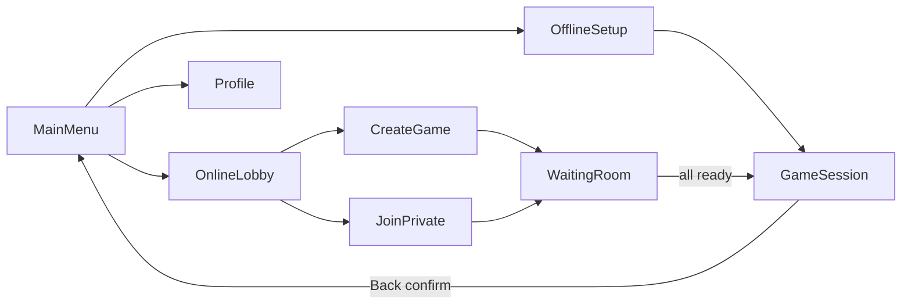

## Online Flow

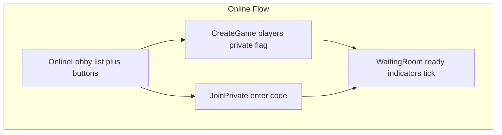

## Таблица маршрутов

| Экран | Маршрут | Аргументы | Back behaviour |
|-------|---------|-----------|----------------|
| Вход | `login` | — | exit app |
| Главный | `main` | — | exit app |
| Оффлайн-настройка | `offline/setup` | — | pop → main |
| Лобби | `online/lobby` | — | pop → main |
| Создание игры | `online/create` | — | pop → lobby |
| Вход по коду | `online/join` | — | pop → lobby |
| Ожидание | `online/waiting/{sessionId}` | sessionId | pop → lobby + leave |
| Профиль | `profile` | — | pop → main |
| Игра | `game/{sessionId}` | sessionId | LeaveGameDialog → main |
| Debug игра | `game/debug` | — | pop (Phase 3 only) |

> **Phase 3 override:** `startDestination = game/debug` на время разработки UI.

## Back navigation (игра)

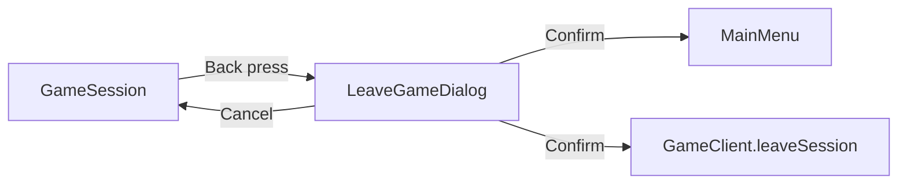

---

## Wireframes

### Login

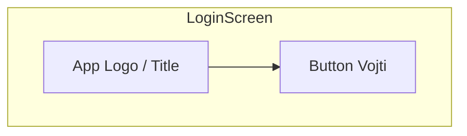

### MainMenu

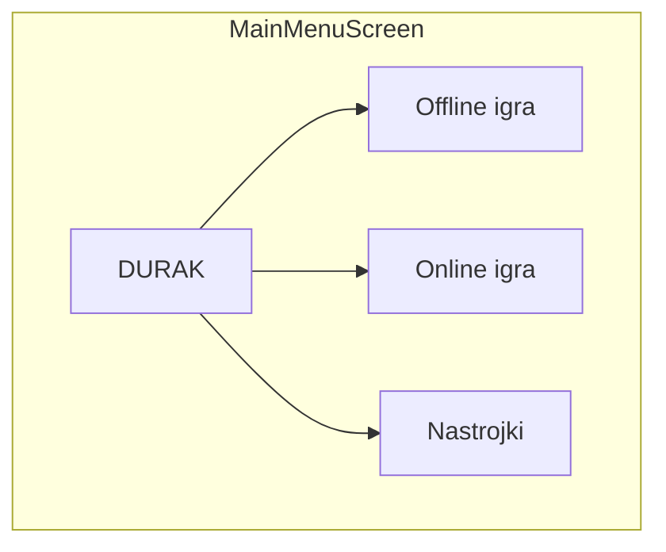

### Profile

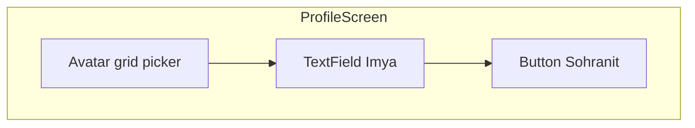

### OfflineSetup

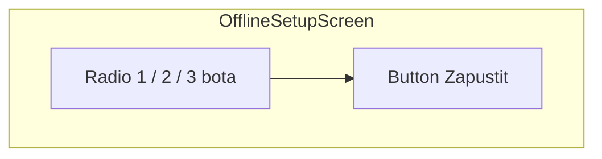

### OnlineLobby

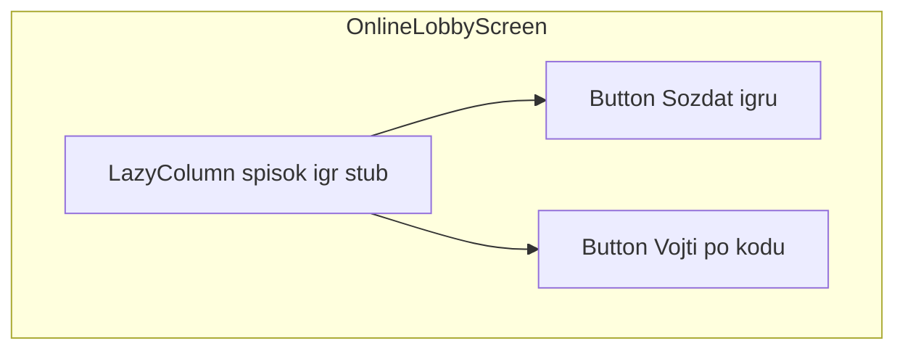

### CreateGame

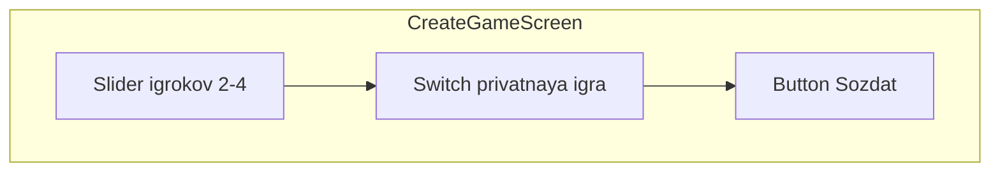

### JoinPrivate

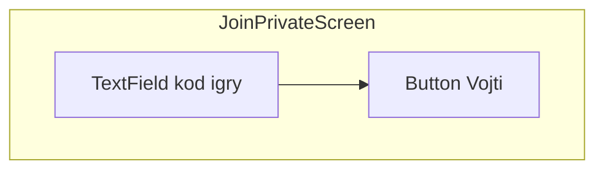

### WaitingRoom

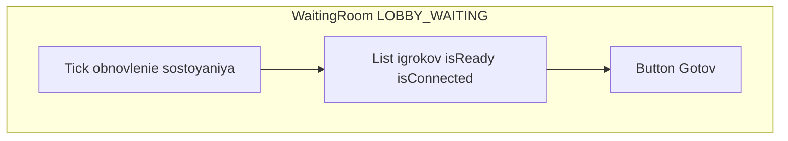

---

## Game Session Layout

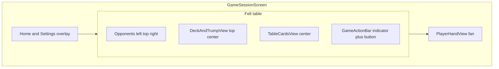

### ASCII layout

```
┌─────────────────────────────────────┐
│ [дом]                         [⚙]   │
│  Бот 1        Бот 2         Бот 3   │
│  веер         веер          веер    │
│              [колода 12]            │
│              [козырь]               │
│         пары атаки/защиты           │
│            · · ·  щит               │
│                          [ Беру ]   │
│     рука игрока веером              │
└─────────────────────────────────────┘
```

## Component Tree (игра)

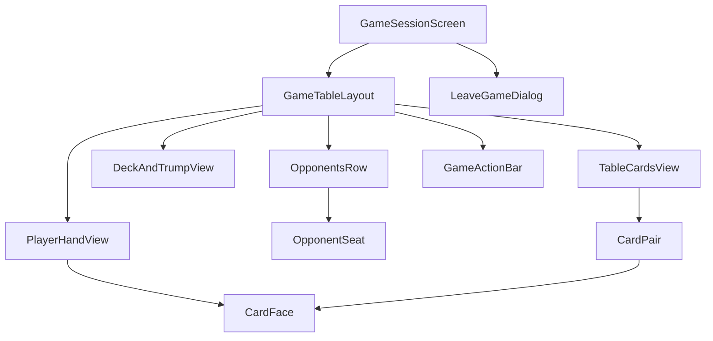

## UI по GamePhase

| Phase | Видимые элементы |
|-------|------------------|
| `LOBBY_WAITING` | PlayerList, кнопка «Готов», индикаторы ready/connected |
| `IN_PROGRESS` | Стол, колода, рука, action bar |
| `FINISHED` | Результат партии, кнопка «В меню» |

## Связанные phase-документы

- [Phase 0 — Login](../phases/phase-00-login/README.md)
- [Phase 1 — Main Menu](../phases/phase-01-main-menu/README.md)
- [Phase 3 — Game UI](../phases/phase-03-game-ui-debug/README.md)
- [Phase 5 — Online](../phases/phase-05-online/README.md)
