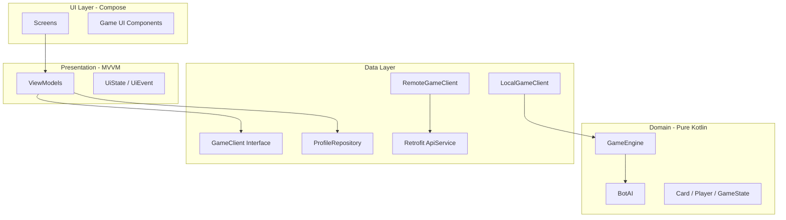
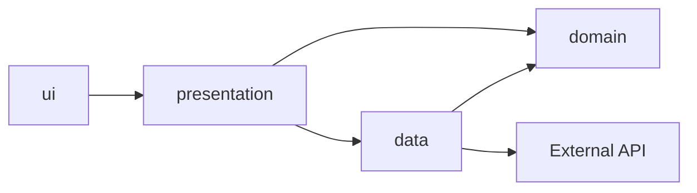

# Архитектура приложения

## Слои MVVM



## Принципы

- **UI** — только Compose, без бизнес-логики.
- **ViewModel** — держит `UiState`, вызывает `GameClient` / repositories.
- **Domain** — чистый Kotlin, без Android-зависимостей.
- **Data** — реализации клиентов, API, локальное хранение.

## Пакетная структура

```
com.example.foolcardgame/
├── ui/
│   ├── navigation/          # NavHost, routes
│   ├── theme/               # Мягкая палитра
│   ├── components/          # CardView, PlayerAvatar, ActionBar...
│   └── screens/
│       ├── login/
│       ├── main/
│       ├── profile/
│       ├── offline/
│       ├── online/
│       └── game/
├── presentation/            # ViewModels + UiState
├── domain/
│   ├── model/
│   ├── engine/              # Логика подкидного дурака
│   └── bot/
├── data/
│   ├── client/              # GameClient, Local*, Remote*
│   ├── api/                 # Retrofit interfaces, DTO
│   ├── repository/
│   └── local/               # DataStore для профиля
└── di/                      # Фабрика клиентов (или Hilt позже)
```

## Зависимости между слоями



- Domain **не зависит** от UI, Android, Retrofit.
- ViewModel **не зависит** от Compose напрямую (только через state).

## Связанные документы

- [Навигация и экраны](navigation-and-screens.md)
- [GameClient](game-client.md)
- [API-контракты](api-contracts.md)
- [Юнит-тесты](testing.md)
