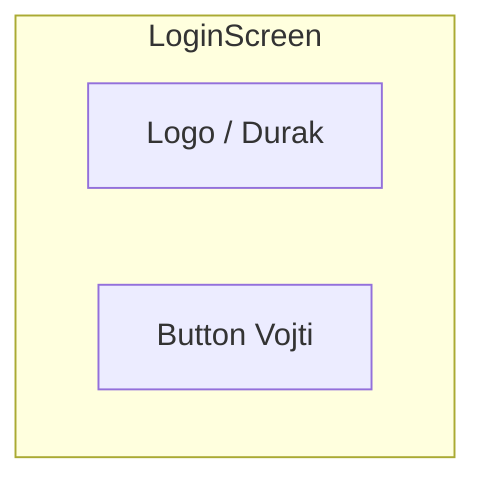

# Phase 0 — Экран входа

## Цель

Реализовать стартовый экран входа с заглушкой: кнопка «Войти» сразу переводит на главный экран (без API).

## Зависимости

- Нет (первый этап).

## Wireframe



Полная версия: [navigation-and-screens.md](../../architecture/navigation-and-screens.md#login)

## Файлы

```
ui/screens/login/LoginScreen.kt
ui/screens/login/LoginViewModel.kt   (опционально, минимальный)
ui/navigation/AppNavGraph.kt
ui/navigation/Routes.kt
```

## Задачи

- [ ] Создать `Routes.kt` с константами маршрутов
- [ ] Создать `AppNavGraph` с `startDestination = login`
- [ ] Реализовать `LoginScreen` (Compose)
- [ ] Кнопка «Войти» → `navigate(main)` { popUpTo(login) { inclusive = true } }
- [ ] Подключить NavHost в `MainActivity`
- [ ] Добавить Gradle-зависимости: Navigation Compose, ViewModel, Coroutines

## DoD

- Приложение стартует с экрана входа
- Нажатие «Войти» открывает главный экран
- Back на главном не возвращает на login (login убран из back stack)
- `./gradlew testDebugUnitTest` — зелёный (если есть тесты этапа)

## Юнит-тесты

| Тест | Описание |
|------|----------|
| `RoutesTest` (опционально) | Константы маршрутов не пустые, `onlineWaiting()` / `game()` формируют путь |

См. [testing.md](../../architecture/testing.md).

## Следующий этап

[Phase 1 — Главный экран](../phase-01-main-menu/README.md)
