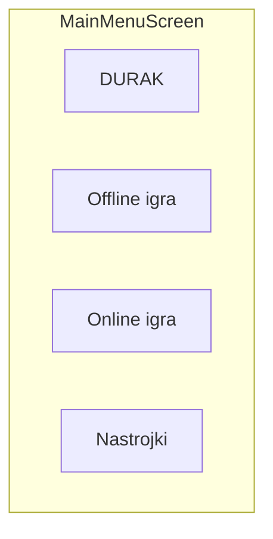

# Phase 1 — Главный экран

## Цель

Главное меню с тремя пунктами: оффлайн-игра, онлайн-игра, настройки.

## Зависимости

- [Phase 0 — Login](../phase-00-login/README.md)

## Wireframe



Полная версия: [navigation-and-screens.md](../../architecture/navigation-and-screens.md#mainmenu)

## Файлы

```
ui/screens/main/MainMenuScreen.kt
ui/navigation/AppNavGraph.kt   (добавить destinations)
```

## Задачи

- [x] `MainMenuScreen` с тремя кнопками
- [x] Навигация: `offline/setup`, `online/lobby`, `profile`
- [x] Заглушки экранов для offline/online/profile (с TopAppBar и «Назад»)
- [x] Единый стиль кнопок (`PrimaryButton`, theme tokens)

## DoD

- Все три пункта меню открывают соответствующие экраны-заглушки
- Back с заглушек возвращает на main
- Тесты этапа не обязательны (логика минимальна)

## Юнит-тесты

Минимум или skip. При желании — smoke-тест навигационных констант из Phase 0.

См. [testing.md](../../architecture/testing.md).

## Следующий этап

[Phase 2 — Профиль](../phase-02-profile/README.md)
