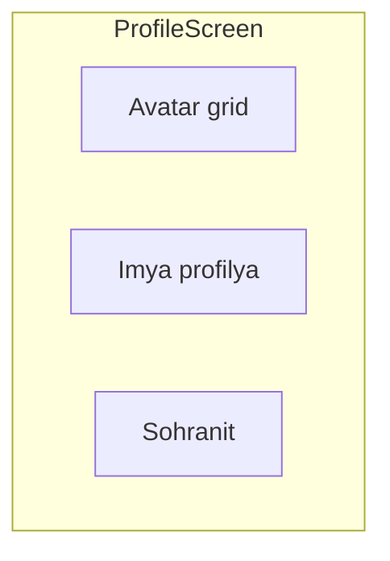

# Phase 2 — Профиль

## Цель

Экран настроек профиля: имя и аватар с локальным сохранением (DataStore) и заглушкой API.

## Зависимости

- [Phase 1 — Main Menu](../phase-01-main-menu/README.md)

## Wireframe



Полная версия: [navigation-and-screens.md](../../architecture/navigation-and-screens.md#profile)

## Файлы

```
ui/screens/profile/ProfileScreen.kt
presentation/profile/ProfileViewModel.kt
presentation/profile/ProfileUiState.kt
data/local/ProfileDataStore.kt
data/repository/ProfileRepository.kt
data/api/ProfileApi.kt
data/api/FakeProfileApi.kt
```

## Задачи

- [x] DataStore: `displayName`, `avatarId`
- [x] `ProfileViewModel` — load/save
- [x] UI: TextField имени, grid аватаров (8 preset)
- [x] `ProfileApi` interface + `FakeProfileApi` (stub POST)
- [x] `ProfileRepository` — local first, затем fake API call
- [x] Кнопка «Сохранить» — persist + snackbar
- [x] Gradle: DataStore, kotlinx-serialization
- [x] `ProfileRepositoryTest`, `ProfileViewModelTest`

## DoD

- Имя и аватар сохраняются между перезапусками приложения
- POST уходит в FakeProfileApi (логируется)
- `ProfileRepositoryTest` и `ProfileViewModelTest` проходят

## Юнит-тесты

| Класс | Сценарии |
|-------|----------|
| `ProfileRepositoryTest` | save → read displayName/avatarId; fake API вызывается |
| `ProfileViewModelTest` | load on init; save updates state; ошибка API → error state |

Зависимости: `coroutines-test`, при необходимости Turbine.

См. [testing.md](../../architecture/testing.md).

## Следующий этап

[Phase 3 — UI игры](../phase-03-game-ui-debug/README.md)
