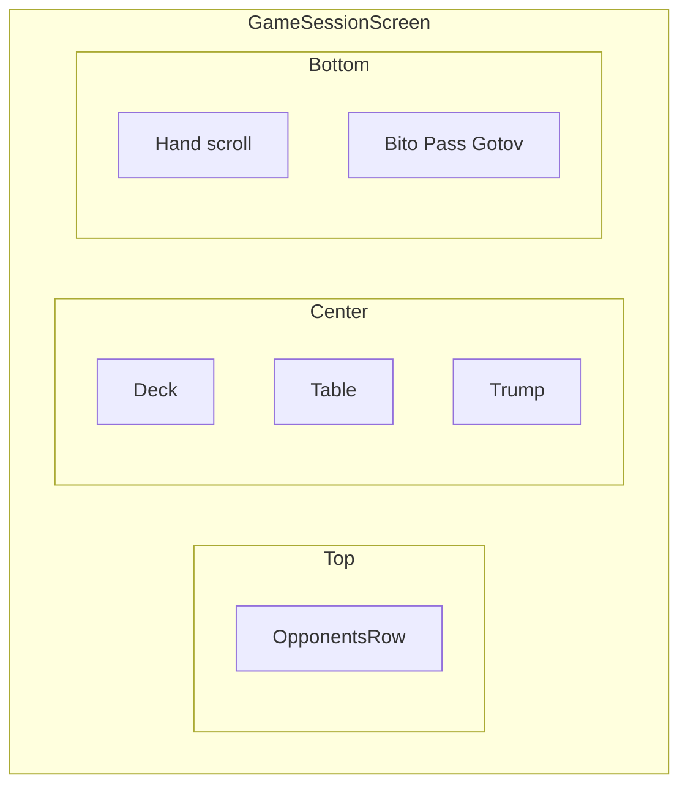
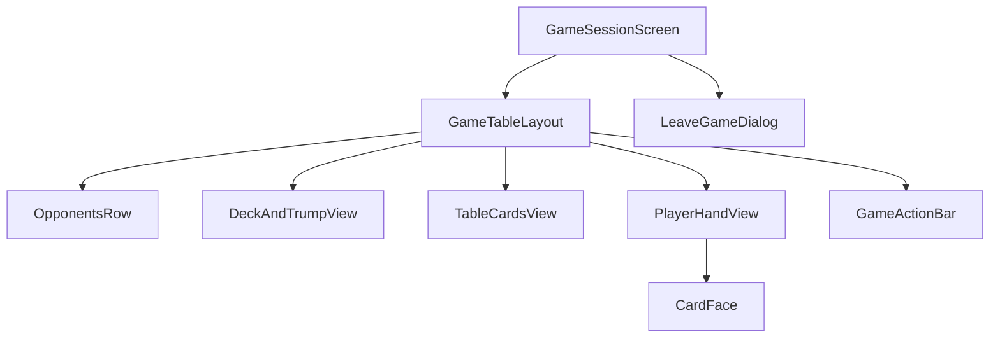

# Phase 3 — UI игры + debug

## Цель

**Критический этап.** Реализовать полный UI игрового экрана с debug-режимом и mock-состоянием. На время разработки — `startDestination = game/debug`.

## Зависимости

- [Phase 0](../phase-00-login/README.md) (навигация)
- Theme из [theme-and-assets.md](../../architecture/theme-and-assets.md)

## Wireframe / Layout



Полная версия: [navigation-and-screens.md](../../architecture/navigation-and-screens.md#game-session-layout)

## Component Tree



## UI по GamePhase

| Phase | UI |
|-------|-----|
| `LOBBY_WAITING` | Список игроков, индикаторы ready/connected, «Готов» |
| `IN_PROGRESS` | Стол, колода, рука, action bar |
| `FINISHED` | Экран результата |

## Файлы

```
ui/screens/game/GameSessionScreen.kt
ui/screens/game/GameDebugScreen.kt
ui/components/game/GameTableLayout.kt
ui/components/game/DeckAndTrumpView.kt
ui/components/game/TableCardsView.kt
ui/components/game/PlayerHandView.kt
ui/components/game/OpponentsRow.kt
ui/components/game/GameActionBar.kt
ui/components/game/LeaveGameDialog.kt
ui/components/card/CardFace.kt
presentation/game/GameViewModel.kt
presentation/game/GameDebugViewModel.kt
presentation/game/GameUiState.kt
data/client/DebugGameClient.kt
```

## Подэтапы

| # | Компонент | Описание |
|---|-----------|----------|
| 3.1 | `GameTableLayout` | Scaffold: top / center / bottom |
| 3.2 | `DeckAndTrumpView` | Колода слева, козырь под ней |
| 3.3 | `TableCardsView` | Пары атака/защита |
| 3.4 | `PlayerHandView` | Вертикальный скролл карт |
| 3.5 | `OpponentsRow` | Аватары + счётчик карт |
| 3.6 | `GameActionBar` | «Бито», «Пас», «Готов» — enabled по state |
| 3.7 | `LeaveGameDialog` | Back → подтверждение |
| 3.8 | Debug mode | Mock states, переключение фаз |
| 3.9 | Анимации | `AnimatedVisibility`, `animate*AsState` |

## Задачи

- [x] `CardFace` composable (программный рендер)
- [x] Все game-компоненты из таблицы
- [x] `DebugGameClient` с fake `observeState` tick
- [x] `GameDebugViewModel` — mock LOBBY_WAITING / IN_PROGRESS / DISCONNECTED
- [x] Debug-панель: кнопки смены состояния
- [x] `MainActivity` startDestination = `game/debug`
- [x] `GameUiStateMapperTest`, `DebugGameClientTest`, `GameDebugViewModelTest`

## DoD

- UI корректно отображает LOBBY_WAITING и IN_PROGRESS
- Индикаторы isReady / isConnected работают на mock tick
- Карты рендерятся программно в мягкой палитре
- LeaveGameDialog работает
- `DebugGameClientTest` (Flow tick) и mapper-тесты проходят

## Юнит-тесты

| Класс | Сценарии |
|-------|----------|
| `GameUiStateMapperTest` | DTO → UiState: фазы, enabled кнопок, индикаторы ready/connected |
| `DebugGameClientTest` | `observeState` emit сразу и по интервалу; action → немедленный emit |
| `GameDebugViewModelTest` | переключение mock-фаз обновляет UiState |

Turbine + `runTest` для Flow. См. [testing.md](../../architecture/testing.md).

## Следующий этап

[Phase 4 — Оффлайн с ботом](../phase-04-offline-bot/README.md)
