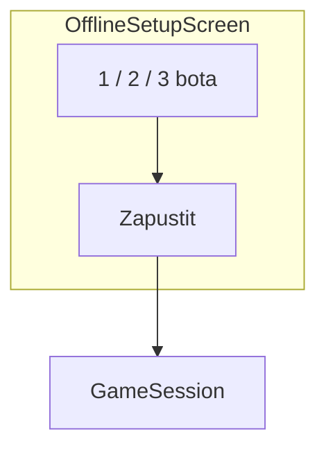

# Phase 4 — Оффлайн с ботом

**Статус: завершён.**

## Цель

Полная игра против 1–3 ботов. Логика в чистом Kotlin (`GameEngine`), UI через `LocalGameClient` как «локальный API».

## Зависимости

- [Phase 3 — Game UI](../phase-03-game-ui-debug/README.md)

## Wireframe



Полная версия: [navigation-and-screens.md](../../architecture/navigation-and-screens.md#offlinesetup)

## Файлы

```
domain/model/Card.kt, Suit.kt, Rank.kt, Player.kt, GameState.kt
domain/engine/GameEngine.kt, Deck.kt, Rules.kt
domain/engine/GameEngine.onTick()
domain/bot/BotAI.kt
data/client/LocalGameClient.kt
ui/screens/offline/OfflineSetupScreen.kt
presentation/offline/OfflineSetupViewModel.kt
presentation/game/GameViewModel.kt  (подключить LocalGameClient)
```

## Задачи

- [x] Domain models (36 карт, игроки, стол)
- [x] `GameEngine`: раздача, playCard, addCard, pass, bito, добор, конец
- [x] `GameEngine.onTick()`: auto-ready ботов
- [x] `BotAI`: атака, отбивка, подкидывание
- [x] `LocalGameClient` implements `GameClient`
- [x] `OfflineSetupScreen`: выбор 1–3 ботов → createSession → game
- [x] `GameViewModel`: collect `observeState`, `leaveSession` in onCleared
- [x] Вернуть старт приложения на `main` (login отложен до online)
- [x] `RulesTest`, `GameEngineTest`, `LocalGameClientTest`, `BotAITest`
- [x] Функциональный тест партии ≥3 игроков (`GameEngineFunctionalTest`)
- [x] Debug-экран (`game/debug`) сохранён

## DoD

- Полная партия 1 человек vs 1–3 бота
- Tick обновляет UI без ручного refresh
- Все actions (playCard, addCard, pass, bito) работают
- **GameEngineTest** покрывает обязательные сценарии из [testing.md](../../architecture/testing.md)

## Юнит-тесты

**Критический этап для тестов.** Фиксированный `seed` колоды.

| Класс | Сценарии |
|-------|----------|
| `RulesTest` | карта бьёт карту (масть, козырь) |
| `DeckTest` | 36 карт, shuffle детерминирован с seed |
| `GameEngineTest` | раздача, атака, отбивка, addCard, pass, bito, добор, конец партии, onTick auto-ready |
| `BotAITest` | бот выбирает легальный ход |
| `LocalGameClientTest` | createSession + playCard + getState; observeState после action |
| `GameEngineFunctionalTest` | полная партия 3 игрока до FINISHED с инвариантами правил |

См. полный список кейсов: [testing.md](../../architecture/testing.md#phase-4--эталонные-сценарии-gameengine).

## Следующий этап

[Phase 5 — Online](../phase-05-online/README.md)
