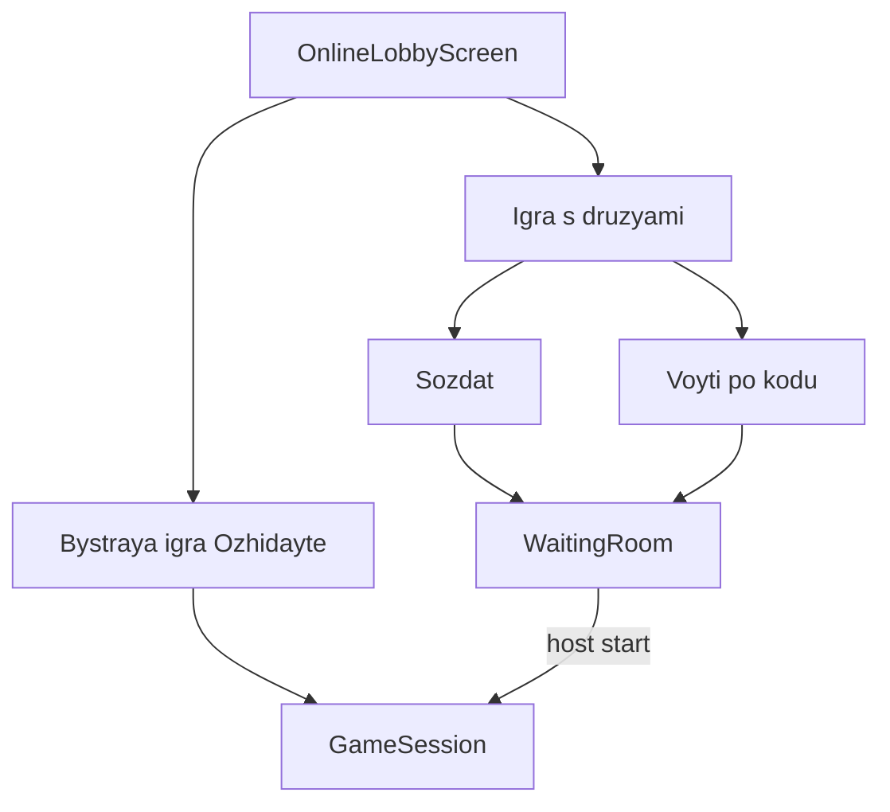

# Phase 5 — Сетевая игра

**Статус: в работе.**

## Цель

Онлайн-лобби без списка игр: **быстрая игра** и **игра с друзьями** → комната ожидания → матч через `RemoteGameClient`.

Дополнительно:
- **Auth gate**: Login → лобби
- Локальный блок имени/аватара в лобби (профиль уходит в теле при входе в игру)
- Настройки без аватара; офлайн `"Вы"` + avatar `0`

## Зависимости

- [Phase 4 — Offline Bot](../phase-04-offline-bot/README.md) — **завершён**

## Wireframes

### Lobby

### Waiting room

Список игроков (poll 5 с), код доступа, `WaitingDots`, у хоста «Удалить» и «Начать игру».

## Задачи

- [x] Auth gate + login fake
- [x] Настройки без аватара; офлайн avatar `0`
- [x] Лобби: быстрая игра (poll `/game/fast/join`) + друзья (create/join)
- [x] WaitingRoom: room poll, kick, start, WaitingDots
- [x] Join по коду
- [x] FakeGameApi stubs `/game/...`
- [x] Тесты Remote / Lobby / Waiting

## DoD

- [x] Нет списка открытых игр
- [x] Быстрая игра и друзья работают на fake API
- [x] Хост стартует матч; kick работает
- [x] Юнит-тесты зелёные

## Следующий этап

[Phase 6 — API Integration](../phase-06-api-integration/README.md)
