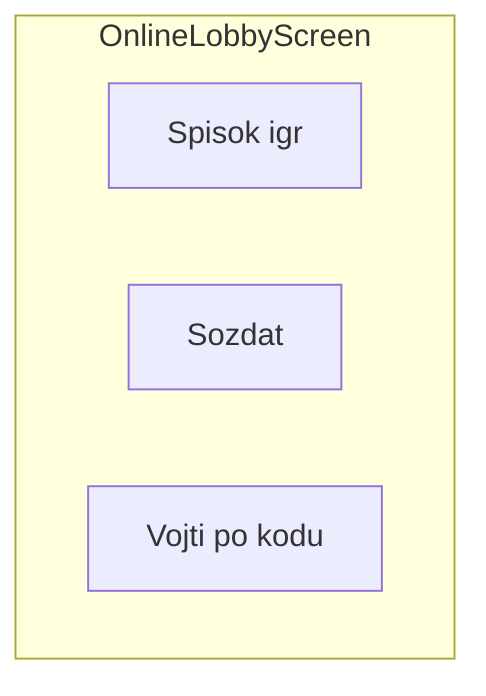

# Phase 5 — Сетевая игра

## Цель

UI лобби и waiting room. `RemoteGameClient` вместо `LocalGameClient` — те же ViewModel и экран игры.

## Зависимости

- [Phase 4 — Offline Bot](../phase-04-offline-bot/README.md)

## Wireframes

### Lobby



### Create / Join / Waiting

См. [navigation-and-screens.md](../../architecture/navigation-and-screens.md#online-flow)

## Файлы

```
ui/screens/online/OnlineLobbyScreen.kt
ui/screens/online/CreateGameScreen.kt
ui/screens/online/JoinPrivateScreen.kt
ui/screens/online/WaitingRoomScreen.kt
presentation/online/OnlineLobbyViewModel.kt
presentation/online/CreateGameViewModel.kt
presentation/online/WaitingRoomViewModel.kt
data/client/RemoteGameClient.kt
data/api/GameApi.kt
data/api/FakeGameApi.kt
data/api/dto/*.kt
```

## Задачи

- [ ] `OnlineLobbyScreen`: stub GET список, кнопки create/join
- [ ] `CreateGameScreen`: игроки 2–4, private toggle
- [ ] `JoinPrivateScreen`: ввод кода
- [ ] `WaitingRoomScreen`: tick, isReady, кнопка «Готов»
- [ ] `RemoteGameClient`: observeState → GET /games/{id}/state
- [ ] `FakeGameApi` / OkHttp interceptor для stub
- [ ] Factory: выбор Local vs Remote GameClient по типу сессии
- [ ] `GameApiDtoTest`, `RemoteGameClientTest`

## DoD

- Лобби + waiting room с tick работают
- Игра идёт через RemoteGameClient (fake API)
- disconnect / not-ready видны в UI
- DTO serialization и RemoteGameClient tests проходят

## Юнит-тесты

| Класс | Сценарии |
|-------|----------|
| `GameApiDtoTest` | JSON ↔ DTO: GameStateDto, PlayerStateDto, actions |
| `RemoteGameClientTest` | MockWebServer: GET state, POST action, leave; tick Flow |
| `WaitingRoomViewModelTest` | ready → state update; disconnected player в UI state |

MockWebServer (OkHttp test). См. [testing.md](../../architecture/testing.md).

## Следующий этап

[Phase 6 — API Integration](../phase-06-api-integration/README.md)
