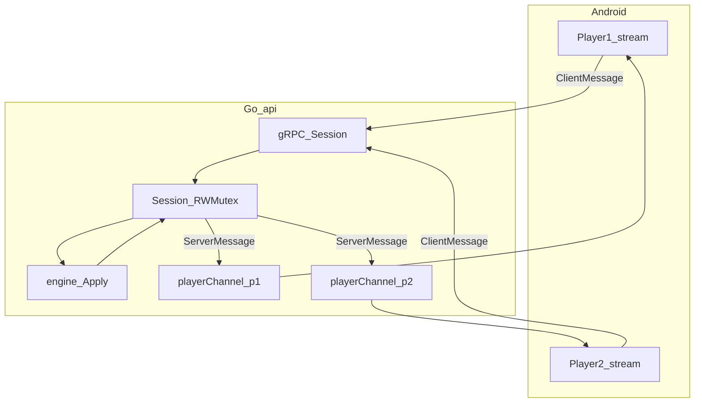
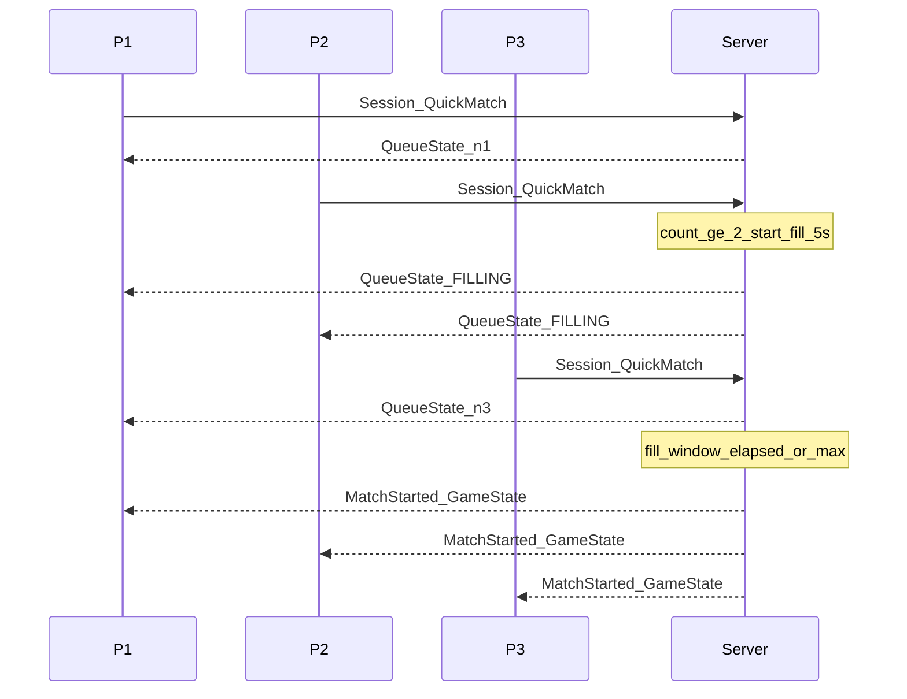

# Этап 4 — Matchmaking, Session hub, Leave

## Цель

In-memory realtime: очередь QuickMatch с автостартом, private комнаты, bidi Session с `playerChannel`, явный Leave.

## Зависимости

- [02-grpc-tls-proto.md](02-grpc-tls-proto.md)
- [03-accounts-db.md](03-accounts-db.md)

## MUST

1. Session hub: `sync.RWMutex`, state/room, `map[playerID]*playerConn` с `playerChannel`.
2. Валидация действий на сервере; broadcast персональных снимков в каналы игроков.
3. QuickMatch по алгоритму ниже; private Create/Join + Subscribe; Leave ≠ disconnect.
4. До старта матча — **нет** INSERT в `games`.
5. При появлении game id — готовность открыть `logs/game-{id}.log` (запись — этап 5).

## In-memory Session + playerChannel

```go
type Session struct {
    mu      sync.RWMutex
    state   *GameState
    room    *RoomMeta
    log     *MatchLog          // заполняется с старта матча
    players map[string]*playerConn
}

type playerConn struct {
    playerID  string
    accountID string
    ch        chan *ServerMessage // playerChannel
}
```

Поток команды:

1. Сообщение со стрима → проверка token / принадлежности к сессии
2. `Lock` → Apply (или matchmaking) → обновить state
3. Для каждого conn: персональный `ServerMessage` → send в `playerChannel`
4. Goroutine стрима читает `ch` и `stream.Send`

Disconnect (обрыв / keepalive): статус `DISCONNECTED`, окно reconnect; новый stream с тем же `player_id` — заменить conn, сразу resnapshot.

Ticker сессии (таймауты ходов — этап 5) под тем же mutex → broadcast.



## QuickMatch (быстрая игра)

Клиент открывает `Session` и шлёт `QuickMatch`. Это очередь с автостартом (без хоста и без клиентского `StartGame`).

| Параметр | Дефолт | Смысл |
|----------|--------|--------|
| `QUICK_MIN_PLAYERS` | 2 | минимум для старта |
| `QUICK_MAX_PLAYERS` | 4 | потолок |
| `QUICK_FILL_WINDOW` | 5s | донабор после ≥ min |
| `QUICK_QUEUE_TIMEOUT` | 120s | не набралось ≥2 → Error |

Алгоритм:

1. Регистрация в **глобальной in-memory очереди**; `QueueState` при каждом изменении (`SEARCHING` / `FILLING`).
2. Пока `< QUICK_MIN_PLAYERS` — ждать (с учётом timeout).
3. При **≥ 2** → фаза `FILLING`, таймер `QUICK_FILL_WINDOW` (5 с); новые QuickMatch вливаются до max.
4. По окончании окна **или** при max=4: создать Session с **новым UUID game id**, привязать 2–4 игроков, кратко `RoomState`, затем **сервер** стартует → `MatchStarted` + `GameState`.
5. `Leave` / закрытие stream в SEARCHING — снять из очереди, обновить QueueState.
6. Если в FILLING после ухода снова `< 2` → **вернуться в SEARCHING**, отменить автостарт.



## Private (друзья)

| Шаг | Действие |
|-----|----------|
| Create | unary → game/session id + access_code + host_id + player_id; комната waiting in-memory |
| Join | unary по code → game_id + player_id |
| Subscribe | stream: `Subscribe(game_id, player_id)` → push `RoomState` |
| Kick | только host, нельзя кикнуть себя как host-единственного по правилам «не кикать host» |
| StartGame | только host, ≥ 2 игрока → UUID уже есть с create; старт engine → MatchStarted |

Код: 6 символов из `ABCDEFGHJKLMNPQRSTUVWXYZ23456789`; normalize uppercase.

## Leave

| Событие | Поведение |
|---------|-----------|
| `ClientMessage.Leave` | Статус `LEFT`; MatchLog `VoluntaryLeaves`; снять channel; broadcast; `LeftAck`; закрытие стрима допустимо |
| Обрыв stream | `DISCONNECTED`; reconnect без пометки «вышел сам» |

- Leave до старта матча: только снять с очереди/комнаты; **в БД игр не писать**.
- Leave в `IN_PROGRESS`: факт ухода в MatchLog; статистика — только после FINISHED (этап 5).

## Сравнение режимов

| | Быстрая | Друзья |
|--|---------|--------|
| Вход | `QuickMatch` в stream | unary Create/Join → Subscribe |
| Waiting | `QueueState` | `RoomState` + код, kick |
| Старт | только сервер | хост `StartGame` |

## Критерии приёмки

- [ ] QuickMatch: 1 ждёт; 2-й → FILLING; 3-й в окне попадает в стол; автостарт без StartGame
- [ ] max=4 стартует до конца окна; Leave из очереди; QUEUE_TIMEOUT
- [ ] FILLING → снова SEARCHING если `< 2`
- [ ] Private: create/join/kick/start; non-host StartGame отказан
- [ ] Leave → LEFT; disconnect → DISCONNECTED
- [ ] Broadcast: ход одного видят все через свои каналы

## Тесты этапа

| Тест | Сценарий |
|------|----------|
| `quick_match_*` | fill window, автостарт, timeout, leave из очереди |
| `private_lobby_*` | kick, start host-only |
| `hub_*` | два игрока, broadcast в playerChannel |
| `leave_*` | Leave vs disconnect; leave из очереди без INSERT games |

## Следующий этап

[05-engine-stats-logging.md](05-engine-stats-logging.md)
