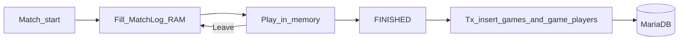

# Этап 5 — Engine, статистика (MatchLog→flush), файловые логи, тесты

## Цель

Порт правил подкидного дурака; завершение матча с записью статистики в MariaDB; полное файловое логирование; набор unit-тестов MVP.

## Зависимости

- [04-matchmaking-session.md](04-matchmaking-session.md)
- [03-accounts-db.md](03-accounts-db.md)
- Правила: [podkidnoy-durak.md](../../docs/game-rules/podkidnoy-durak.md)
- Эталон: Kotlin `GameEngine` / `Rules`

## MUST

1. Авторитетный engine в `internal/engine`: раздача, атака/отбивка/подкид, бито/беру, добор, конец (дурак / ничья), таймауты 60 с / 30 с, `onTick`.
2. Все проверки ходов на сервере; клиент шлёт намерение.
3. `MatchLog` в RAM с старта матча; **INSERT в БД только при FINISHED**.
4. `FULL_LOGGING` (дефолт `true`): realtime логи; `errors.log` всегда.
5. Уникальный game id согласован с лог-файлом и PK.

## Домен engine

Порт с Kotlin:

- Колода 36, 2–4 игрока, по 6 карт, козырь
- Отбивка: выше той же масти или козырь
- Подкид: ранги на столе; лимит `min(6, рука защитника на старте раунда)`
- «Беру» / «Бито», добор, смена атакующего
- Конец: последний с картами = дурак; все без карт = ничья (`DRAW`)
- Действия: `playCard`, `addCard`, `pass`, `bito`, `ready` (+ Leave с этапа 4)
- Per-player `GameState`: своя рука полная, чужие — `hand_count`

Leave во время игры: партия продолжается по правилам engine (карты ушедшего / автопропуски — зафиксировать в коде по аналогии с offline `leave`); в `game_players.player_result` при flush — `LEFT` если ушёл добровольно до конца.

## MatchLog → flush

```go
type MatchLog struct {
    GameID          string
    AccessCode      string
    StartedAt       time.Time
    PlayersAtStart  int
    Seats           []MatchSeat
    VoluntaryLeaves map[string]time.Time
}
```

Правила:

1. Старт матча → заполнить MatchLog; **нет** INSERT `games`.
2. Во время игры / Leave → только RAM.
3. `FINISHED` → транзакция: `INSERT games` + `INSERT game_players` для каждого seat старта (`WIN`/`FOOL`/`DRAW`/`LEFT`).
4. Без FINISHED (рестарт, все вышли из waiting) — статистика не пишется.



## Файловое логирование

| Env | Поведение |
|-----|-----------|
| `FULL_LOGGING=true` (дефолт) | IN/OUT/domain в `logs/game-{id}.log`; очередь — `logs/matchmaking.log` |
| `FULL_LOGGING=false` | game/matchmaking файлы не писать |
| всегда | `logs/errors.log` — технические ошибки |

Пакет `internal/logging`: потокобезопасно, line-buffered / sync на диск, sink на игру.

### Содержимое `game-{id}.log`

1. **IN** — путь (`Session/PlayCard`), `account_id`, `game_id`, действие, карты UTF (`♠A`, рука `[♠6 ♥K]`).
2. **OUT** — кому отправлено, тип сообщения, краткое резюме state.
3. **Domain** — фазы, бито/беру, таймауты, Leave, FINISHED.

Примеры:

```text
2026-09-09T23:10:01Z IN Session/PlayCard account=acc_12 game=550e8400-... action=playCard card=♠A hand=[♠6 ♥K ♦9]
2026-09-09T23:10:01Z OUT account=acc_15 game=550e8400-... msg=GameState phase=IN_PROGRESS action=ATTACK table=♠A
```

`errors.log`: panic recover, DB, TLS, gRPC internal, сбой flush.

## Критерии приёмки

- [x] Партия 2–4 игрока доходит до FINISHED по правилам
- [x] До FINISHED таблица `games` пуста; после — 1 строка + N `game_players`
- [x] DRAW vs HAS_FOOL; Leave → `player_result=LEFT`
- [x] FULL_LOGGING: есть `game-{id}.log` с IN/OUT; ошибка → `errors.log`
- [x] FULL_LOGGING=false: game-файл нет; errors пишется
- [x] Тесты в `server/src/tests` зелёные

## Тесты этапа (и сводные MVP)

| Тест | Сценарий |
|------|----------|
| `engine_*` | атака, отбивка, козырь, подкид, бито, take, конец, ничья |
| `stats_flush_*` | нет записи до FINISHED; flush; LEFT |
| `logging_*` | game log IN/OUT; errors; флаг FULL_LOGGING |
| `hub_*` / `quick_match_*` / `leave_*` / `auth_*` / `game_id_*` | см. этапы 3–4 |
| reconnect | resnapshot после нового stream |

## Следующий этап (клиент)

[06-android-phase6.md](06-android-phase6.md)
